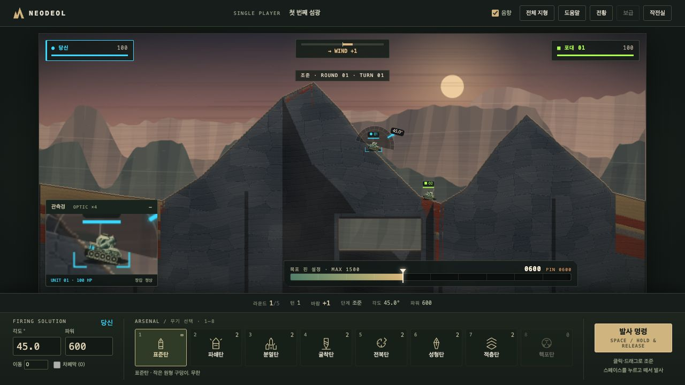
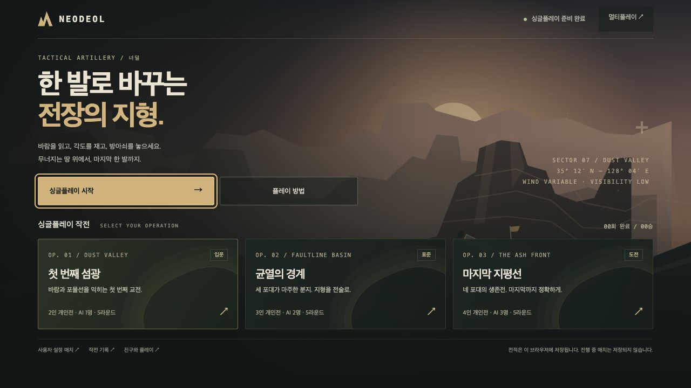
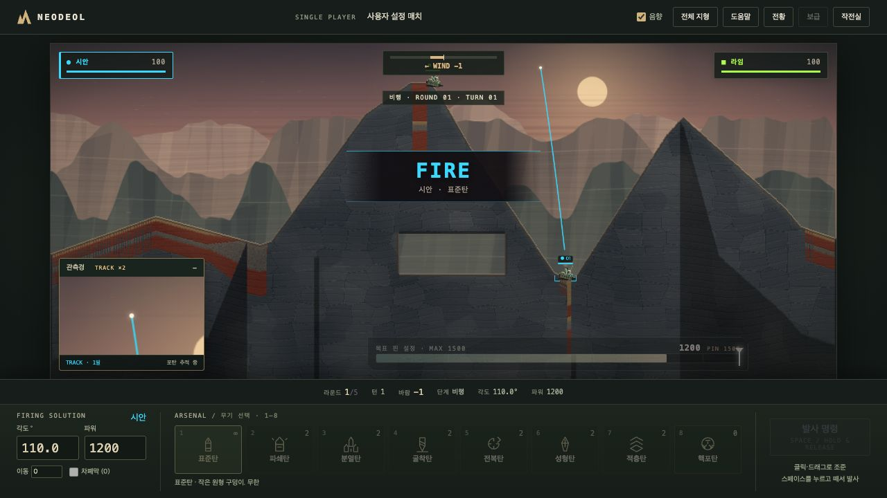
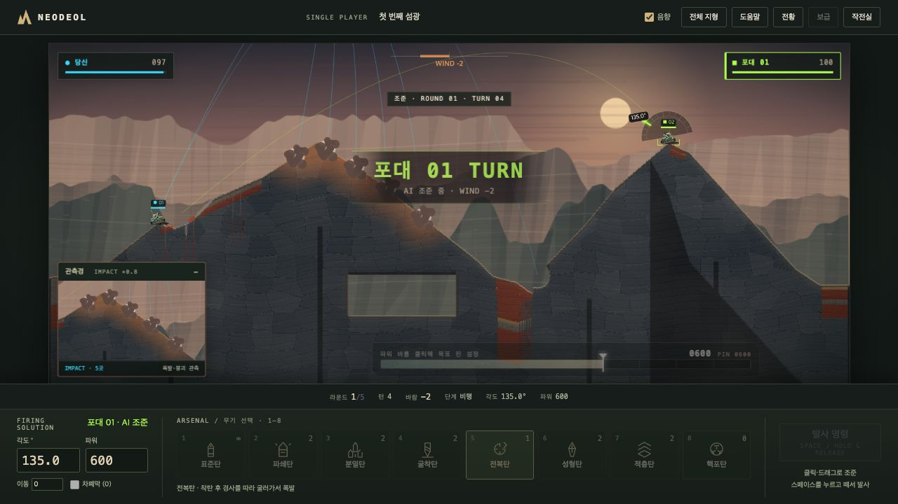

# Neodeol · 너덜

### 한 발로 바꾸는 전장의 지형.

바람을 읽고, 능선 너머를 겨냥하고, 무너지는 땅 위에서 다음 한 발을 준비하세요.
**Neodeol은 파괴와 붕괴가 다음 턴의 전술이 되는 웹 기반 턴제 포병 게임입니다.**

싱글플레이 AI 작전부터 친구와의 멀티플레이까지. 황혼의 산악 전장, 직접 조절하는 각도와 파워,
포탄을 따라가는 관측경이 한 번의 사격을 작은 전투로 만듭니다.



<sub>실제 로컬 플레이 화면입니다. 현재는 플레이 가능한 Canvas 프로토타입이며 멀티플레이 안정화를 진행하고 있습니다.</sub>

> **In English** — A turn-based artillery game with collapsing, destructible terrain,
> single-player AI operations, and multiplayer rooms. Every shot reshapes the battlefield.
> The TypeScript client and authoritative Python server reproduce the same integer simulation.
> Design documentation is maintained in Korean.

---

## 전장이 달라지는 이유

| | 플레이 경험 |
|---|---|
| **무너지는 지형** | 폭발로 생긴 구멍에서 끝나지 않습니다. 흙과 자갈이 흘러내리고, 발밑이 사라진 탱크는 추락하거나 매몰됩니다. |
| **매번 다른 교전** | 큰 봉우리와 골짜기, 모래·점토·자갈·암반 구역. 작전을 시작할 때 지형과 배치를 새로 뽑아 근접전과 장거리전을 만듭니다. |
| **읽고 조절하는 사격** | 각도, 최대 1500의 파워, 바람을 조합합니다. 화면에 고정된 풍향계로 카메라가 움직여도 바람을 확인할 수 있습니다. |
| **따라가는 관측경** | 조준할 때는 탱크를 확대하고, 발사하면 포탄을 추적합니다. 분열과 착탄 뒤의 폭발·붕괴도 이어서 관찰합니다. |
| **8종의 무기 · 4종의 장비** | 표준탄부터 분열탄·굴착탄·적층탄까지. 피해를 줄지, 땅을 바꿀지 선택하고 라운드 사이 상점에서 재정비합니다. |
| **5라운드의 승부** | 지형의 상처가 다음 라운드에도 남습니다. 한 라운드의 생존뿐 아니라 누적 점수와 보급까지 생각해야 합니다. |

PC에서는 **21:9 와이드 전장**을 기본으로 사용하며 `전체 지형` 버튼으로 16:9 전체 맵을 볼 수 있습니다.
모바일에서는 전체 지형을 유지합니다. 탱크의 장갑·궤도, 지층의 질감과 폭발 흔적은 실제 게임 상태 위에 그립니다.

## 혼자 시작해도 괜찮습니다



| 작전 | 구성 | 이런 플레이에 |
|---|---|---|
| **01 · 첫 번째 섬광** | 나와 AI 1명 · 입문 | 각도와 파워를 익히는 첫 교전. AI는 더 크게 빗나가고, 초반에는 표준탄으로 대응합니다. |
| **02 · 균열의 경계** | 나와 AI 2명 · 표준 | 지형 변화와 보급 선택까지 고려하는 3인 개인전. |
| **03 · 마지막 지평선** | 나와 AI 3명 · 도전 | 정확한 사격과 남은 탄약이 중요한 4인 생존전. |

모든 작전은 처음부터 선택할 수 있습니다. 인원·난이도·시드를 정하는 **사용자 설정 매치**와
로컬 핫시트도 제공합니다. 완료 횟수·승리·최고 점수는 이 브라우저에 기록됩니다.
계정 간 동기화나 진행 중 매치 저장 기능은 아직 없습니다.

| 비행 중 포탄 추적 | 분열탄 착탄·붕괴 관측 |
|---|---|
|  |  |

<sub>관측경은 현재 비행 중인 포탄을 따라가며, 착탄 뒤에는 폭발 영역과 뒤따르는 붕괴를 보여줍니다.</sub>

## 바로 실행하기

Docker와 Docker Compose가 준비되어 있다면:

```bash
git clone https://github.com/pan889/Neodeol.git
cd Neodeol
docker compose up -d --build
```

브라우저에서 **[localhost:8000](http://localhost:8000/)** 을 열면 작전실로 이동합니다.

| 경로 | 용도 |
|---|---|
| [`/tools/prototype/`](http://localhost:8000/tools/prototype/) | 싱글플레이 · 사용자 설정 · 로컬 핫시트 |
| [`/tools/multiplayer/`](http://localhost:8000/tools/multiplayer/) | 멀티플레이 룸 생성·참가 및 네트워크 검증 화면 |
| [`/sandbox/`](http://localhost:8000/sandbox/) | 모래 붕괴 실험실 |
| [`/version`](http://localhost:8000/version) | 실행 중인 시뮬레이션 버전·규칙 지문 |

외부 호스팅 서비스가 아니라 로컬 실행 방법입니다. 친구가 다른 기기에서 접속하려면 서버의 주소와
포트 접근 설정이 필요합니다. 상세 설정은 [개발 환경](docs/development.md)을 참고하세요.

### 기본 조작

| 조작 | 기능 |
|---|---|
| 전장 클릭·드래그 / `←` `→` | 포신 각도 조절 |
| 마우스 휠 / `↑` `↓` / 파워 입력란 | 발사 파워 조절 |
| `Shift` + 방향키 | 미세 조절 |
| 파워 바 클릭·드래그 | 목표 파워 핀 지정 — 참고 표시이며 자동 발사는 아닙니다 |
| `Space` 누르기 → 놓기 | 파워 충전 → 발사 |
| `발사 명령` 클릭 | 현재 설정된 파워로 발사 |
| `1`–`8` | 무기 선택 |
| `전체 지형` / `와이드 전장` | PC 전장 시야 전환 |

## 같은 한 발, 같은 지형

멀티플레이의 기반은 **결정론적 lockstep**입니다. 클라이언트는 각도·파워·무기 같은 발사 의도를 보내고,
권위 서버가 동일한 시뮬레이션으로 검증합니다. 평상시에는 전체 지형 대신 명령을 공유하며,
접속·재접속·불일치 복구에는 스냅샷을 사용합니다.

- **TypeScript → Python 1:1 이식** — 정수 서브픽셀 좌표와 공유 삼각함수 테이블.
- **순서 독립적인 붕괴** — 제안과 충돌 해소를 분리한 모래 자동자.
- **표현과 규칙의 분리** — Canvas·카메라·효과가 물리 상태를 바꾸지 않습니다.
- **교차 리플레이 검증** — 같은 입력의 지형 체크섬·질량·턴 결과를 양쪽 구현에서 대조합니다.

```bash
npm --prefix client test
node --test client/tests/operations.mjs client/tests/operations-integration.mjs \
  client/tests/battlefield-art.mjs client/tests/scope-camera.mjs
docker compose exec server python -m pytest /app/tests -m 'not slow'
npm --prefix client run test:cross-sim
```

전체 스택 점검은 `bash scripts/verify-stack.sh`, 장기 회귀 검사는 [개발 환경 문서](docs/development.md)를 참고하세요.
규칙 변경으로 골든 리플레이를 갱신할 때는 변경 이유를 함께 기록합니다.

## 개발 현황과 문서

**구현됨:** 정수 시뮬레이션과 서버 미러, 파괴·붕괴·무기·상점, 싱글플레이 작전실,
Canvas 전장, 멀티플레이 lockstep 수직 슬라이스.

**진행 중:** 4인 실기기·장기 매치·재접속 및 오프라인 상황을 포함한 멀티플레이 안정화.
WebGL2 최종 렌더러와 상용 서비스 운영은 아직 완료 단계가 아닙니다.
완료 기준과 다음 단계는 [로드맵](docs/roadmap.md)이 기준입니다.

| 문서 | 내용 |
|---|---|
| [기획 결정](docs/decisions.md) · [게임 디자인](docs/game-design.md) | 확정된 규칙, 변경 근거와 미결 항목 |
| [지형](docs/terrain.md) · [맵 생성](docs/mapgen.md) | 붕괴 자동자, 산악 지형과 랜덤 배치 |
| [시뮬레이션](docs/simulation.md) · [매치](docs/match.md) | 탄도·폭발·턴·경제·승패 |
| [네트워크](docs/netcode.md) · [렌더링](docs/rendering.md) | lockstep, 복구 흐름과 아트 디렉션 |
| [개발 환경](docs/development.md) · [기여 규칙](CLAUDE.md) | 실행·검증 명령과 구현 원칙 |

## 이름과 라이선스

**Neodeol(너덜)** 은 절벽 아래 무너져 쌓인 돌 더미와 그 비탈을 뜻하는 우리말 **너덜겅**에서 왔습니다.
지질학의 *talus / scree* 지대, 그리고 이 게임의 핵심인 안식각이 만나는 이름입니다.

[GNU AGPL v3.0](LICENSE). 라이선스 조건은 `LICENSE` 전문을 참고하세요.

Scorched Earth 계열 포병 게임의 턴제 사격 구조에서 출발했지만,
무기 이름·탱크 그래픽·전장 아트·UI는 이 프로젝트의 표현으로 구성합니다.
